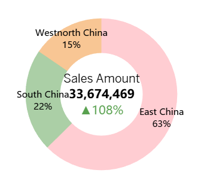
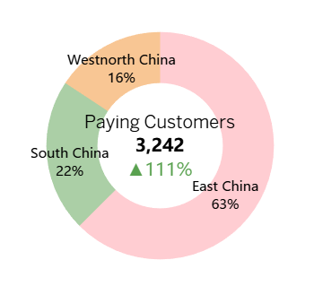

# Overview
This project analyzes and monitors the monthly sales performance of a sample company using Tableau. It aims to provide a interactive dashboard which enables business stakeholders to track KPIs, identify trends, and uncover insights for better decision-making. This README file shows the data visualizations for June as an example. The full data for all months can be explored via the dashboard link below.

# Live Dashboard
[View Tableau Dashboard](https://public.tableau.com/app/profile/ziang.liu5667/viz/salestransactiondata/MonthlySalesDataMonitoring)

# Questions
Below are the questions I want to answer:
1. How is total sales revenue and paying customers trending month-over-month? 
2. How does the Average Order Value (AOV) vary across months?
3. How do installment plans affect purchasing behavior and AOV?
4. How does sales performance vary over time across different regions?
5. How do different installment plans affect total sales and customer adoption?

# Tools
- Tableau: I used Tableau to connect datasets, clean data, visulize the results and build the dashboard
- GitHub: For version control

# Data Preparation

The sales data from April to July was first combined with the August dataset using a union operation, then joined with the sales employees dataset on sales id to enrich the information. The date format was standardized, and the month was extracted as parameter, enabling monthly trend analysis.

Since the August sales data lacked region details, the region value from the employees dataset was used in the final dataset. A hierarchy was then created — Region → Province → Team → Sales ID — to enable drill-down analysis in Tableau and support more granular insights.

# Analysis

## 1. How is total sales revenue and paying customers trending month-over-month

To analyze the month-over-month trend of total sales revenue and paying customers, both metrics were aggregated by region, and the month-over-month growth rates were calculated. A donut chart was then created to visualize the comparison, providing a clear overview of the overall sales performance.

### Results

### Insights
- East China contributes the largest share of total sales and revenue at approximately 57%, followed by South China at around 24%, while Northwest China contributes the least at about 18%.
- Both total sales and revenue show a consistent month-over-month increase, indicating steady growth in the company’s market presence.

## 2. How does the Average Order Value (AOV) vary across months

After removing all null values, the Average Order Value (AOV) was calculated by dividing total revenue by the number of paying customers. Analyzing Average Order Value (AOV) helps evaluate customer purchasing behavior and revenue efficiency.

### Results

### Insights:
- The analysis shows that the average order value has been steadily decreasing over the months.

## 3. How do installment plans affect purchasing behavior and AOV

The Average Order Value (AOV) was aggregated by installment plan to analyze the impact of different payment options on customer purchasing behavior. This helps identify whether customers tend to spend more when choosing higher installment plans compared to paying in full.

### Results

### Insights
- Installment plans of 6, 12, and 18 months show significantly higher Average Order Value compared to 1, 3, and 9 months, with the 12-month installment plan resulting in the highest AOV overall.

## 4. How does sales performance vary over time across different regions
The sales amount, number of paying customers, Average Order Value (AOV), and their respective month-over-month (MoM) changes were visualized using bar charts, aggregated by different regions. The sales amount was aggregated by region and visualized using a line chart to illustrate the trend.

### Results

### Insights
- The results show some rapid fluctuations, roughly following a 5-day cyclical pattern, but generally align with the insights mentioned above.
- East China contributes the most, sales amount and number of paying customers are increasing, while AOV is decreasing.
- Overall, there is minimal regional variation within the company.

  
## 5. How do different installment plans affect total sales and customer adoption
The sales amount, number of paying customers, average order value (AOV), and their respective month-over-month (MoM) changes were visualized using bar charts, aggregated by different installment plans. Additionally, the sales amount was visualized with a line chart to illustrate its trend across installment options.

### Results

### Insights
- Installment plans of 6, 12, and 18 months contribute the most to total sales, with higher numbers of paying customers and AOV.
- Among them, the 12-month plan achieves the highest sales amount and AOV overall.

# Insights

This project provided several insights into the data job market for analysts:

- Core skills like SQL, Python, and Excel remain highly in demand, especially for Data Analysts, Data Scientists, and Data Engineers. However, specialized tools such as Hugging Face, Bitbucket, and mxnet command higher salaries despite being less frequently requested.

- Visualization shows that Python consistently offers one of the highest median salaries, while SQL remains the most demanded skill overall. Tableau and Power BI strike a strong balance between demand and compensation, making them valuable tools for aspiring analysts.

- Senior roles, especially in Data Science and Engineering, show significantly higher and more variable salary ranges, indicating greater value and reward for expertise and experience.

- Ultimately, the most optimal skillset for a data analyst includes a mix of high-demand foundational tools and high-paying niche skills. Staying current with market trends and diversifying technical competencies is key to increasing employability and maximizing salary potential.

# What I Learned From This Project
- The importance of aligning one's skills with market demand. Understanding the relationship between skill demand, salary, and job availability allows for more strategic career planning in the tech industry.
- How to perform data analysis using Python.
- Data cleaning and filtering is so important before analyzing anything. It could remove all the unnecessary and wrong data to make the analysis more reliable.
- Visualization is the last but most important step to show your results. The axis, color, title, theme etc, they all reflect how you express your insights.
- Designing effective visual representations of complex datasets was challenging but critical for conveying insights clearly and compellingly.
- How to balance the overview of the landscape while diving into each analysis.
